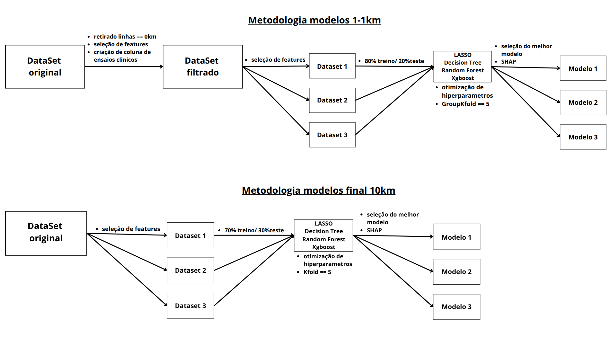

# **Estrutura de desenvolvimento dos modelos**

O desenvolvimento dos modelos preditivos foi conduzido através de duas metodologias computacionais distintas e paralelas, cada uma adaptada para um escopo de predição específico, conforme intitulado Figura 1: "modelos 1-1km" e "modelos final 10km". Ambas as abordagens seguiram um pipeline estruturado de pré-processamento de dados, seleção de features, treinamento, otimização e seleção de modelos, levando à interpretação dos modelos finais. 

**Figura 1**

**Figura 1.** Pipelines metodológicos para a construção e avaliação dos modelos de machine learning. São apresentadas duas abordagens distintas. A superior ("1-1km") envolve uma etapa de pré-processamento e filtragem de dados, seguida pela criação de três subconjuntos de features, divisão 80/20 (treino/teste) e otimização de modelos com GroupKFold (k=5). A inferior ("10km") gera os subconjuntos diretamente dos dados originais, com divisão 70/30 e otimização via KFold padrão (k=5). Ambas as metodologias testam os algoritmos LASSO, Decision Tree, Random Forest e XGBoost, e utilizam SHAP para a interpretabilidade dos modelos finais selecionados.

## **Metodologia para os Modelos de predição de Tcore a cada 1-1km**

A primeira abordagem metodológica iniciou-se com o pré-processamento do **DataSet original**. Esta etapa envolveu um tratamento rigoroso dos dados, que incluiu: (i) a exclusão de todas as instâncias (linhas) em que a kilometragem era igual a zero, garantindo que a base de dados contemplasse apenas dados durante o exercício fśico; (ii) a aplicação de uma seleção de características (features) inicial, baseada no conhecimento de domínio fisiológico ou em análises exploratórias preliminares; e (iii) a engenharia de uma nova feature, denominada "trial_id", para identificar o ensio clínico afim de evitar a superestimação do valor de predição do algoritmo. O resultado deste processo foi um **Dataset Filtrado**, que serviu como base para as etapas subsequentes.

A partir do **Dataset Filtrado**, foi realizado um segundo processo de seleção de features, o qual deu origem a três subconjuntos de dados distintos e não-exclusivos: **Dataset 1** (Km, IBUTG, pele, fc), **Dataset 2** (Km, IBUTG, pele, fc, UB, UR, TS, TU) e **Dataset 3** (Km, IBUTG, pele, fc, velocidade). Esta estratégia permitiu a avaliação subsequente do desempenho dos modelos em função de diferentes combinações de variáveis preditoras que abrangessem variações fisiológicas intrínsecas ao aumento da temperatura interna e variáveis ambientais que pudessem estar associadas.

Cada um desses três datasets foi então submetido a um pipeline de modelagem idêntico. Primeiramente, os dados foram particionados em conjuntos de treino (80%) e teste (20%). A fase de treinamento e validação envolveu a realização de experimentos com quatro algoritmos de aprendizado de máquina distintos: LASSO (Least Absolute Shrinkage and Selection Operator), uma técnica de regressão linear regularizada que simultaneamente realiza a seleção de variáveis; Árvore de Decisão (Decision Tree); e dois métodos de ensemble robustos, Random Forest e XGBoost (Extreme Gradient Boosting).

Para cada algoritmo, foi conduzida uma otimização de hiperparâmetros para encontrar a configuração ótima de parâmetros que maximizasse o desempenho preditivo. Este processo de otimização foi realizado utilizando uma estratégia de validação cruzada robusta, a GroupKFold com 5 folds (k=5). A escolha da GroupKFold é particularmente importante, pois garante que as observações de um mesmo grupo (e.g., mesmo indivíduo em diferentes momentos) não sejam divididas entre os conjuntos de treino e validação dentro das folds, prevenindo assim o vazamento de dados (data leakage) e a superestimação do desempenho do modelo.

Após o treinamento e a otimização, procedeu-se à seleção do **melhor modelo** para cada um dos três datasets iniciais (Dataset 1, 2 e 3). A seleção foi baseada em métricas de desempenho avaliadas no conjunto de teste (R²/RMSE). Finalmente, para os modelos campeões de cada pipeline (aquele que obter o menor RMSE)(Modelo 1, Modelo 2, Modelo 3), foi aplicada a técnica de SHAP (SHapley Additive exPlanations). O uso de SHAP permitiu a interpretação da "caixa-preta" dos modelos, quantificando a contribuição de cada feature para as predições individuais e globais, aumentando a transparência e a confiabilidade dos resultados.

## **Metodologia para os Modelos de predição de Tcore ao final de 10km**

A segunda abordagem metodológica, embora estruturalmente similar à primeira, apresentou modificações chave. Partindo de um DataSet reduzido oriundo do trabalho de Andrade _et al_., 2024, denominado no fluxograma de **DataSet original**, a primeira etapa consistiu em uma seleção de features, gerando três subconjuntos de dados: **Dataset 1** (WBGT, Running Speed, Inicitial_core, body_mass, Tcore-Tskin, Tskinmean, sweat_rate, Vo2Max, HR, Delta_mass), **Dataset 2** (WBGT, Running Speed, Inicitial_core, Tcore-Tskin, Tskinmean, sweat_rate, Vo2Max, HR, Delta_mass) e **Dataset 3** (WBGT, Running Speed, Tcore-Tskin, sweat_rate, Vo2Max, HR). Para cada um desses três datasets, a partição dos dados foi ajustada para uma proporção de 70% para treino e 30% para teste, uma escolha de proporção que é justificada pela base de dados reduzida. O conjunto de algoritmos avaliados permaneceu o mesmo (LASSO, Decision Tree, Random Forest, XGBoost), e a otimização de hiperparâmetros também foi realizada.

Uma diferença metodológica crucial reside na estratégia de validação cruzada: nesta segunda abordagem, foi utilizada a KFold padrão com 5 folds (k=5), em vez da GroupKFold. Essa mudança implica que não havia uma estrutura de agrupamento nos dados que necessitasse de tratamento especial.

As etapas finais foram análogas às da primeira metodologia: o modelo de melhor desempenho foi selecionado para cada um dos três datasets (R² e RMSE), e a análise de interpretabilidade foi conduzida utilizando SHAP sobre os modelos finais (Modelo 1, Modelo 2, Modelo 3), permitindo a comparação da importância das features sob estas diferentes condições de modelagem.
